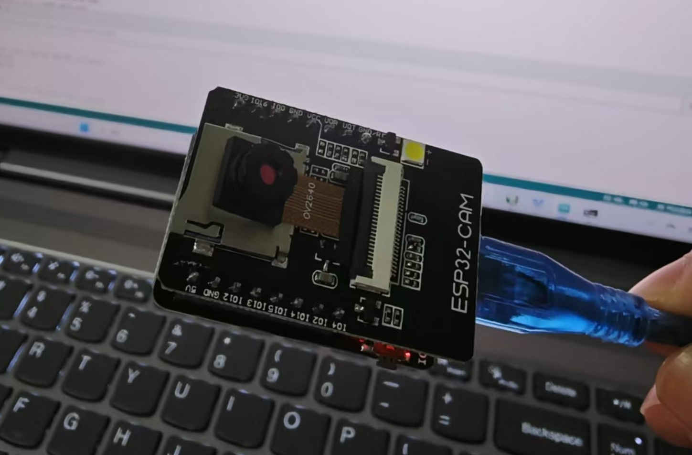
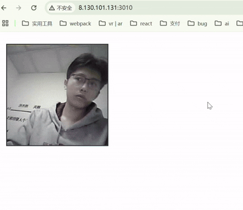
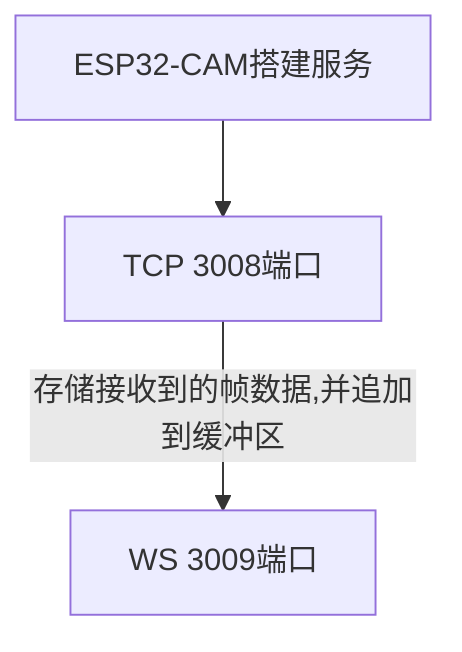
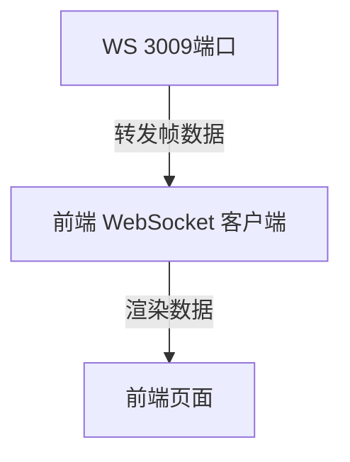

# esp32-cam-node

> 最近在学习硬件相关的，发现网上似乎没有用node做中转服务器的，简单记录一下esp32-cam通过node转发到公网的流程， 我的硬件是 OV2640_PID + esp32 cam，成本30左右





> 最终效果如下




## esp32转发到node服务

首先在esp32 中 搭建服务，然后把帧数据转发到 node的3008端口，这个端口充当数据处理的作用， 具体流程见下图




### esp32-cam配置

用的是arduino的CameraWebServer 示例代码然后做了点修改， 原来的代码见这里

https://github.com/espressif/arduino-esp32/blob/master/libraries/ESP32/examples/Camera/CameraWebServer/

核心修改的点如下 

- 1. CameraWebServer.ino:  esp32启动文件

  -  wifi账号和密码：ssid  和  password 换成你自己的 wifi账号和密码
  -  摄像头型号：`if (s->id.PID == OV3660_PID)` 中的 ov后面的型号换成你自己的
  - 板子型号：`#define CAMERA_MODEL_AI_THINKER `  的注释 打开，然后把那个默认的 CAMERA_MODEL 注释掉


- 2. app_httpd.cpp

主要是添加 发送帧的事件，下面是工具方法

```c

#include <lwip/sockets.h>
#define LED_LEDC_CHANNEL 2 //Using different ledc channel/timer than camera
// 服务器配置
const char *server_ip = ""; // 替换为你的 Node.js 服务器 IP
const int server_port = 3008;           // 替换为你的 Node.js 服务器端口

struct UploadParams {
    uint8_t *buf;
    size_t len;
};

// 定义帧上传任务
void uploadFrameToServer(uint8_t *frame, size_t frame_len) {
    int sockfd;
    struct sockaddr_in server_addr;
    // 创建 Socket
    if ((sockfd = socket(AF_INET, SOCK_STREAM, 0)) < 0) {
        ESP_LOGE("SOCKET", "Socket creation error");
         Serial.print("Socket creation error");
        return;
    }

    // 配置服务器地址
    server_addr.sin_family = AF_INET;
    server_addr.sin_port = htons(server_port);
    if (inet_pton(AF_INET, server_ip, &server_addr.sin_addr) <= 0) {
        ESP_LOGE("SOCKET", "Invalid address / Address not supported");
        Serial.print("Invalid address / Address not supported");
        return;
    }

    // 连接到服务器
    if (connect(sockfd, (struct sockaddr *)&server_addr, sizeof(server_addr)) < 0) {
        ESP_LOGE("SOCKET", "Connection failed");
        Serial.print(" connect error ");
        return;
    }

    // 发送帧数据
    if (send(sockfd, frame, frame_len, 0) < 0) {
        ESP_LOGE("SOCKET", "Frame send failed");
    } else {
        ESP_LOGI("SOCKET", "Frame sent successfully");
    }

    // 关闭 Socket
    close(sockfd);
}

```


然后在合适的地方调用它， 我们不难发现 代码中有很多 `if (res == ESP_OK) {` 结合上下文，这里是发送帧事件的地方


```c
// ================ 新增上传代码 ================
if (res == ESP_OK && _jpg_buf != NULL && _jpg_buf_len > 0) {
    // 深拷贝帧数据
    uint8_t *upload_buf = (uint8_t*)malloc(_jpg_buf_len);
    if (upload_buf) {
        memcpy(upload_buf, _jpg_buf, _jpg_buf_len);
        
        // 创建参数结构体
        UploadParams *params = (UploadParams*)malloc(sizeof(UploadParams));
        params->buf = upload_buf;
        params->len = _jpg_buf_len;
        
        // 创建异步上传任务
        xTaskCreatePinnedToCore(
            [](void *param) {
                UploadParams *p = (UploadParams*)param;
                uploadFrameToServer(p->buf, p->len);
                free(p->buf); // 释放缓冲区
                free(p);      // 释放参数结构体
                vTaskDelete(NULL);
            },
            "frame_upload",
            8192,       // 堆栈大小
            params,     // 传递参数结构体
            9999,          // 优先级（高于主循环）
            NULL, 
            PRO_CPU_NUM // 运行在PRO核心
        );
    } else {
        log_e("Malloc for upload buffer failed!");
    }
    
    delay(100);
}
```


最后把代码烧录进去就好了。至此 esm32的配置就结束了


### tcp-3008配置

通过node的net模块创造一个tcp出来, 这部分代码比较简单，接收esm32发送的帧数据然后用buffer组装即可

```js

import net from 'net';
import {WebSocketServer } from 'ws';


// step1: 配置

// 1.1 tcp服务器端口，用来接收c语言帧数据
const PORT = 3008;
const HOST = '0.0.0.0'; 

// 1.2 node 服务器端口, 用来连接c语言服务器和前端，起到转发的作用
const WS_PORT = 3009;

// 1.3 前端端口
const FRONT_PORT = 3010;


// step1: 创建 前端用以交互的 WebSocket 服务器
const webSocketServerCase = new WebSocketServer({  port: WS_PORT });
// step2: 创建 TCP 服务器
const server = net.createServer((socket) => {
    console.log('Client connected:', socket.remoteAddress, socket.remotePort,);

    let frameBuffer = Buffer.alloc(0); // 用于存储接收到的帧数据

    // 接收数据
    socket.on('data', (data) => {
        frameBuffer = Buffer.concat([frameBuffer, data]); // 将数据追加到缓冲区
    });
    // 客户端断开连接时保存帧数据
    socket.on('end', () => {
       
    });

    // 错误处理
    socket.on('error', (err) => {
        console.error('Socket error:', err);
    });
});

```


## node 服务中转帧数据




### ws-3009配置

这部分核心代码如下

```js
// 发送
...

socket.on('end', () => {
        if (frameBuffer.length > 0) {
            // 将帧数据发送给前端
            if (webSocketServerCase.clients.size > 0) {
                for (const client of webSocketServerCase.clients){
                    client.send(frameBuffer);
                }
            }
        }
});

...
// 前端页面
import express from 'express';
import cors from 'cors';
import path from 'path';
const app = express();

app.use(cors());
// step4: 嵌入前端
app.get('/',(req,res)=>{
    res.sendFile(path.resolve("./index.html"))        //设置/ 下访问文件位置
});
app.listen(FRONT_PORT, () => {
    console.log(`Server listening on ${HOST}:${FRONT_PORT}`);
});
```


### html界面

```html
<!DOCTYPE html>
<html>
<head>
    <title>STM32 CAM Viewer</title>
    <style>
        img { max-width: 80%; margin: 20px; border: 2px solid #333; }
    </style>
</head>
<body>
    
    <script>
        const address = 'ws://your-ip-address:3009'
        const ws = new WebSocket(address);
        const frameImg = document.getElementById('frame');

        ws.onmessage = (event) => {
            console.log('Received frame data:', event.data);
            const blob = new Blob([event.data], { type: 'image/jpeg' });
            frameImg.src = URL.createObjectURL(blob);
        };
    </script>
</body>
</html>
```


## 怎么启动

烧录上传至服务器后

- 访问arduino 115200串口输出的wifi地址 加上 :81/stream
- 然后访问前端界面就好了